

  
  <h1>VR Motor Control Diagnostic Tool — User Guide</h1>
  
<strong>Version 1.0</strong> · <em>Audience:</em> commissioning engineers, firmware developers

---

## Contents

1. First run with Demo
2. Connecting to drives
3. Main window tour
4. Left-tab panels (Control · Gains · Signal generator)
5. Detachable panes (Profile · Tuning · PDO map)
6. Configure Drive dialog
7. Commissioning workflow
8. Tuning workflows
9. PDO mapping — read, edit, apply
10. Telemetry recording & export
11. Emergency stop
12. Keyboard shortcuts
13. Troubleshooting
14. Appendix A — Transports
15. Appendix B — CiA 402 OD reference
16. Appendix C — Command-line flags

---

## 1. First run with Demo

The fastest way to verify the install is to use the bundled simulator
— no real hardware, no extra terminals. Launch the diagnostic, then:

1. **Help → Start demo…**
2. Pick a slave count (default 3, range 1–32).
3. The diagnostic spawns that many `vrmc_sim` processes on UDP
   multicast `239.192.0.42:23400` with sequential node IDs (5, 6,
   7, …) and **auto-connects**.
4. The slave list populates, MotorView lights up for the first
   slave, and the telemetry pane starts plotting position /
   velocity / torque.

The simulator runs entirely inside the diagnostic's own build tree
(`vrmc_sim` next to `vr_mc_diagnostic`), so this workflow works
straight out of the box — no need to compile or run anything from
`vr-mc-sdk` separately.

To stop:

- **Help → Stop demo** — terminates the sim processes cleanly.
- Pressing the toolbar **Disconnect** also stops the demo (Help
  menu state flips back to "Start demo" enabled).
- Closing the diagnostic kills any surviving sim child processes
  so nothing is left listening on the multicast group.

### Trying the Control tab against the demo

Once auto-connect lands, the first slave is selected and you can
drive it straight away:

1. Click **Bringup** in the Control tab — the state readout strip
   walks `SWITCH_ON_DISABLED → READY_TO_SWITCH_ON → SWITCHED_ON →
   OPERATION_ENABLED` (badge turns green).
2. Type a value into the Setpoint spinbox (default unit = rad in
   Position mode) and click **Send** — the MotorView needle swings
   to the new angle. Try the preset buttons `+π/4` / `−π/4` /
   `Home` for one-click setpoints.
3. Tick `[deg]` in the readout strip to switch the spinbox + slider
   + tracking-error display to degrees.
4. Move the slider with **stream live** checked to scrub the
   setpoint in real time.
5. **E-STOP** (toolbar, far right) — instantly disarms every slave
   and pops the panel buttons back to disabled.

If anything in this sequence fails, look at the Log dock at the
bottom: every SDO error, PDO online event, and demo-process
lifecycle line lands there with a timestamp.

---

## 2. Connecting to drives

**Connection → Connect…** (`Ctrl+K`).

| Transport | Fields | When |
|-----------|--------|------|
| UDP multicast | Group, Port | Loopback against sim, multi-host bench |
| ZLG USB-CANFD | Channel, bitrate, FD-bitrate | Real drives |

Both take **First node id** + **Count**. The diagnostic registers that
range sequentially into `master_mgr`.

**Reconnect** (`Ctrl+R`) replays the last config. **Disconnect** is
idempotent — worker thread survives for the next connect.

---

## 3. Main window tour

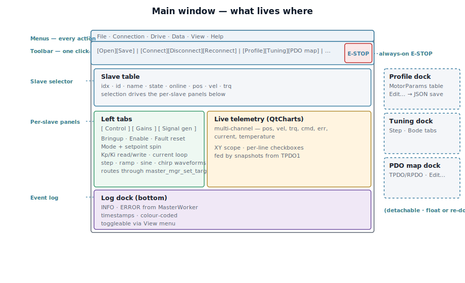

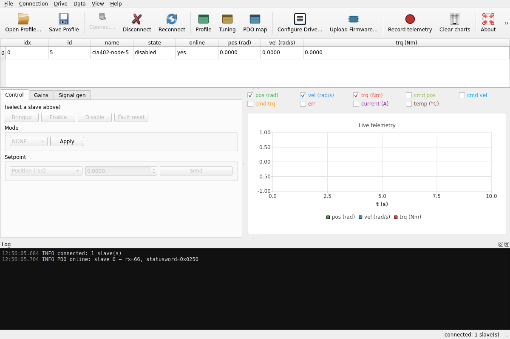

Toolbar groups (L→R): File · Connection · View (dock toggles) · Drive ·
Data · Help · E-STOP (always right-anchored, `Space` shortcut).

Slave table = one row per slave. Selection drives every per-slave
panel.

---

## 4. Left-tab panels

### Control

Drives the CiA 402 state machine:

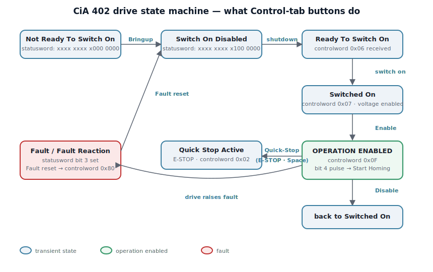

- **Bringup** — Not Ready → Switched On
- **Enable** — → Operation Enabled (only motion-accepting state)
- **Disable** — back to Switched On (torque off)
- **Fault reset** — pulses CW bit 7 → Switch On Disabled

**Mode** selector + **Setpoint** spin box route through `master_mgr_set_target_one`.

### Gains

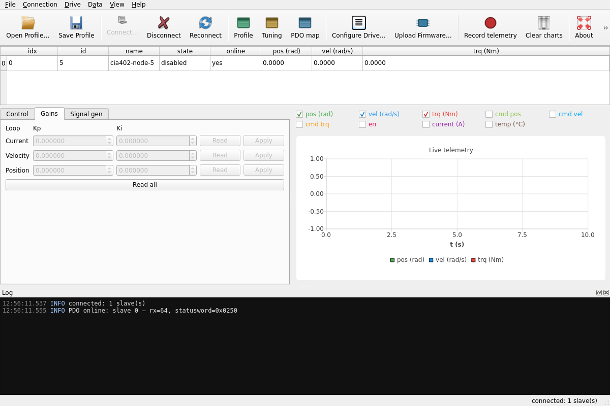

Per-loop (current / velocity / position) Kp+Ki. Read pulls current
values via SDO; Write pushes back.

### Signal generator

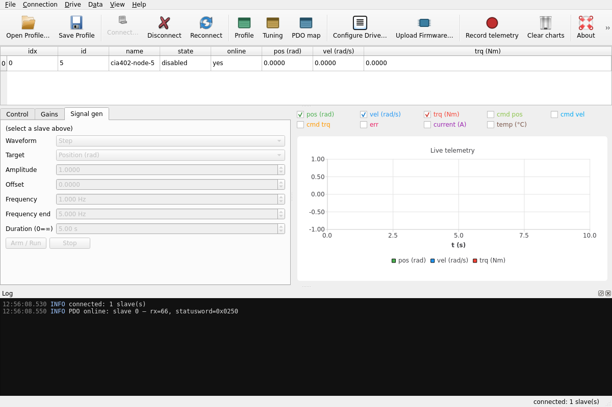

Waveforms: constant · step · ramp · sine · chirp. Chirp feeds the Bode
sweep.

---

## 5. Detachable panes

Created hidden + floating. Toolbar View group brings them out.

### Profile

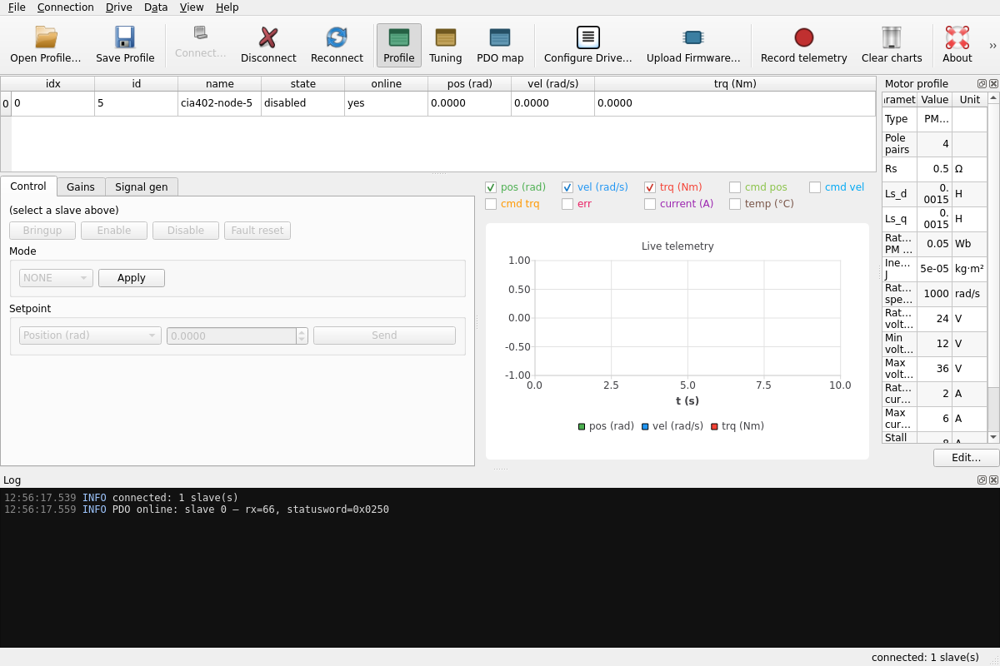

Read-only 15-row `MotorParams` table (type, pole pairs, Rs, Ls_d, Ls_q,
rated flux, inertia, voltage/current limits). **Edit…** opens a modal;
File → Save Profile persists to JSON.

### Tuning

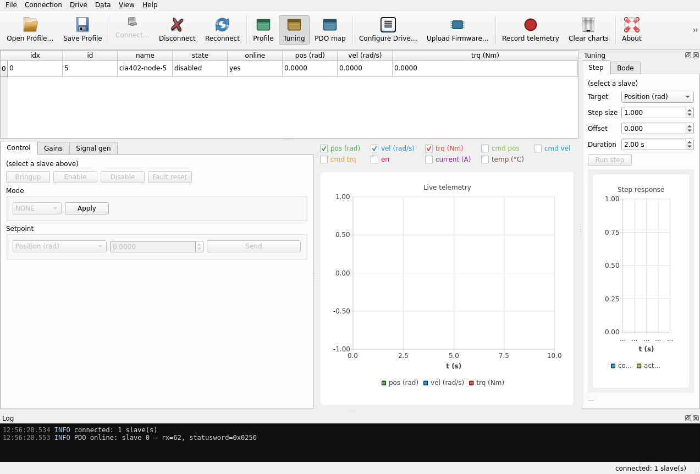

- **Step** — target, step size, offset, duration → run → overshoot, rise time, SS error
- **Bode** — log-sweep chirp + Goertzel correlation → magnitude/phase vs. frequency

### PDO map

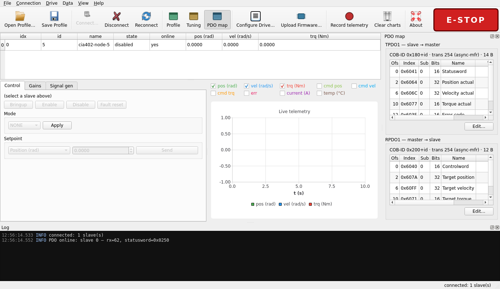

Two sections (TPDO1 / RPDO1). Offset, OD index, sub, bits, name, live
value. **Edit…** runs the CiA 301 §7.2.2.2 remap dance via SDO.

---

## 6. Configure Drive

**Drive → Configure Drive…** (`Ctrl+Shift+C`).

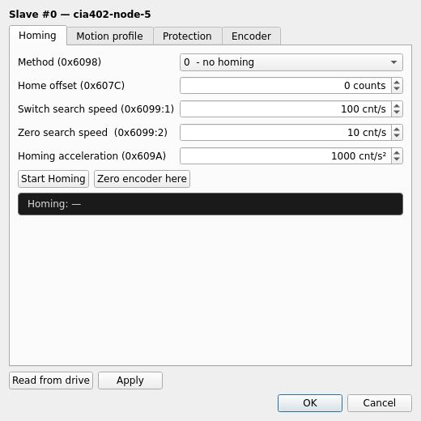

Modeless tabbed dialog. Opens with the selected slave, kicks off a
batch SDO read so the form reflects the drive.

### 6.1 Homing

| Field | OD |
|-------|-----|
| Method | `0x6098` |
| Home offset | `0x607C` |
| Switch search speed | `0x6099:1` |
| Zero search speed | `0x6099:2` |
| Homing acceleration | `0x609A` |

**Start Homing** — mode=6, controlword `0x000F → 0x001F`:

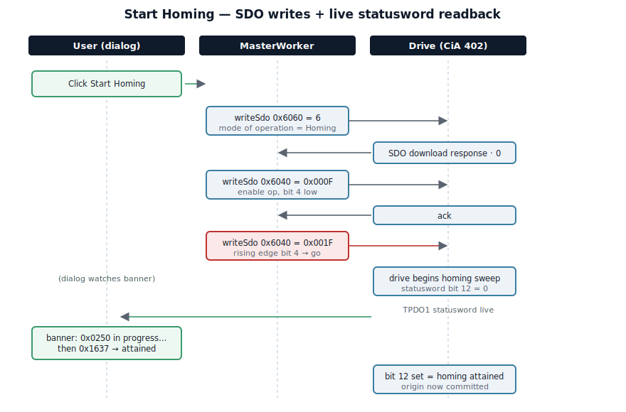

**Zero encoder here** — reads `0x6064`, writes `0x607C`, updates form.

### 6.2 Motion profile

Profile velocity `0x6081`, accel `0x6083`, decel `0x6084`, quickstop
decel `0x6085`.

### 6.3 Protection

Following error `0x6065` + timeout `0x6066`, pos limits `0x607D:1,2`,
max speed `0x6080`, max torque `0x6072`. **Zero torque here** reads
`0x6077`, writes `0x60B2`.

### 6.4 Encoder

Resolution `0x608F:1`, gear ratio `0x6091:1,2`, feed constant
`0x6092:1,2`.

### Buttons

- **Read from drive** — batch SDO upload; missing fields reported, not aborted
- **Apply** — batch SDO download
- **OK** — Apply + close · **Cancel** — discard

---

## 7. Commissioning workflow

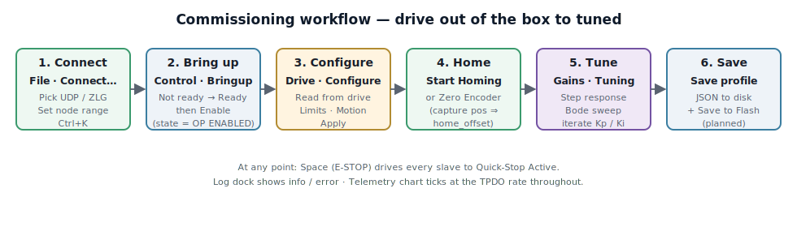

1. **Connect** — Ctrl+K → transport → node range.
2. **Bring up** — Control tab → Bringup → Enable.
3. **Configure** — Drive → Configure → Read → set limits → Apply.
4. **Home** — Start Homing (method-driven) or Zero encoder here.
5. **Tune** — Gains Read → Tuning step/Bode → iterate Kp/Ki.
6. **Save** — File → Save Profile + Drive → Save to Flash (planned).

> **Safety.** Keep `Space` reachable the first time you enable a new
> drive. Wrong limits + wrong mode = motion outside the safe envelope
> in one control cycle.

---

## 8. Tuning workflows

### Step response

1. Drive Operation Enabled + correct mode.
2. Tuning dock → Step sub-tab → set params → **Run step**.
3. Read overshoot %, 10–90 % rise, SS error.
4. Iterate: bump Kp until overshoot, back off 20 %, add Ki.

### Bode sweep

1. Tuning dock → Bode → freq start/end + duration.
2. **Run sweep** → chirp fires → Goertzel extracts I/Q per frequency.
3. Read −3 dB crossover + phase margin.

---

## 9. PDO mapping — read, edit, apply

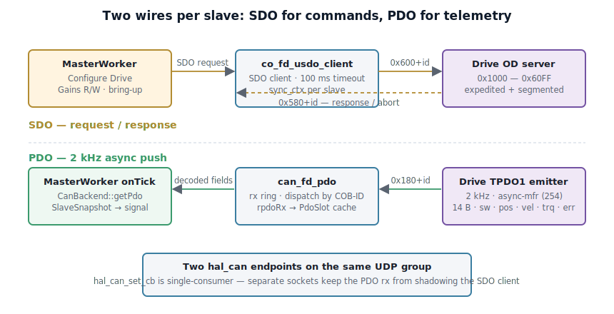

Two `hal_can` endpoints per connection — one SDO, one PDO — because
`hal_can_set_cb` is single-consumer.

Edit flow: PDO map dock → **Edit…** → add/remove from CiA 402 catalog
→ OK. Under the hood:

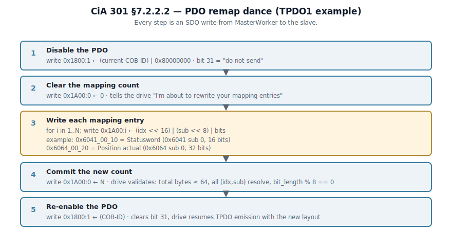

Against the simulator every step SDO-aborts (`0x06020000`) because the
sim doesn't expose `0x1600`/`0x1A00`. Against real drives the sequence
completes and the TPDO layout changes take effect on next emission.

---

## 10. Telemetry recording & export

- **Record telemetry** (`Ctrl+Shift+R`) — toggle; currently a placeholder (CSV-per-snapshot planned).
- **Export telemetry CSV…** — dumps buffered chart data.
- **Clear charts** — empty the scope.

---

## 11. Emergency stop

Red button, toolbar right edge. `Space` app-wide. On click: stop
generator → `master_mgr_disable_all` → every slave → Switch On
Disabled. Re-enable via normal Control tab Bringup + Enable.

---

## 12. Keyboard shortcuts

| Combo | Action |
|-------|--------|
| `Ctrl+K` | Connect… |
| `Ctrl+R` | Reconnect |
| `Ctrl+E` | Edit motor profile |
| `Ctrl+Shift+C` | Configure Drive… |
| `Ctrl+Shift+R` | Toggle recording |
| `Ctrl+O` / `Ctrl+S` | Open / Save profile |
| `Space` | E-STOP |
| `F1` | Documentation |

---

## 13. Troubleshooting

| Symptom | Cause | Check |
|---------|-------|-------|
| Configure Drive: "all fields aborted" | Drive doesn't expose these OD objects | Use a real drive |
| `Session timeout` | Drive not responding / wrong id / bus down | Verify id + transport |
| PDO Value column stays `—` | No TPDO — not emitting or COB-ID mismatch | Log "PDO online" line should appear |
| E-STOP disabled | Not connected | Connect first |
| Start Homing no effect | Drive not Operation Enabled | Enable on Control first |
| Floating dock off-screen | Window moved | Toggle from toolbar/View menu |

---

## Appendix A — Transports

### UDP multicast (`hal_can_udp`)

Two sockets per connection; both bound `0.0.0.0:23400` with
`SO_REUSEADDR`. Joined `239.192.0.42`, `IP_MULTICAST_LOOP=1`. 12-byte
header `[tag·4][cob_id·4][dlc·1][flags·1][rsvd·2]`; tag filters self-echoes.

### ZLG USB-CANFD (`hal_can_zlg`)

`libcontrolcanfd.so` via `dlopen()` at runtime; ships in
`src/backends/zlg/lib/` (RPATH-wired). One endpoint per channel; PDO
not yet plumbed (V1 is SDO-only).

---

## Appendix B — CiA 402 OD quick reference

| Index | Sub | Field | Where |
|-------|-----|-------|-------|
| `0x1010` | 1 | Store parameters | Save to Flash (planned) |
| `0x1011` | 1 | Restore defaults | Load from Flash (planned) |
| `0x1400+n` | 1 | RPDO COB-ID | PDO remap |
| `0x1600+n` | 0..N | RPDO mapping | PDO mapping editor |
| `0x1800+n` | 1 | TPDO COB-ID | PDO remap |
| `0x1A00+n` | 0..N | TPDO mapping | PDO mapping editor |
| `0x603F` | 0 | Error code | TPDO1 |
| `0x6040` | 0 | Controlword | Control · Homing |
| `0x6041` | 0 | Statusword | TPDO1 · banners |
| `0x6060` | 0 | Mode of operation | Control · Homing |
| `0x6064` | 0 | Position actual | TPDO1 · Zero encoder |
| `0x6065` | 0 | Max following error | Protection |
| `0x6066` | 0 | Following error timeout | Protection |
| `0x606C` | 0 | Velocity actual | TPDO1 |
| `0x6072` | 0 | Max torque | Protection |
| `0x6077` | 0 | Torque actual | TPDO1 · Zero torque |
| `0x607A` | 0 | Target position | RPDO1 |
| `0x607C` | 0 | Home offset | Zero encoder here |
| `0x607D` | 1,2 | Position limits | Protection |
| `0x6080` | 0 | Max motor speed | Protection |
| `0x6081` | 0 | Profile velocity | Motion |
| `0x6083` | 0 | Profile acceleration | Motion |
| `0x6084` | 0 | Profile deceleration | Motion |
| `0x6085` | 0 | Quickstop deceleration | Motion |
| `0x608F` | 1 | Encoder resolution | Encoder |
| `0x6091` | 1,2 | Gear ratio | Encoder |
| `0x6092` | 1,2 | Feed constant | Encoder |
| `0x6098` | 0 | Homing method | Homing |
| `0x6099` | 1,2 | Homing speeds | Homing |
| `0x609A` | 0 | Homing acceleration | Homing |
| `0x60B2` | 0 | Torque offset | Zero torque here |
| `0x60FF` | 0 | Target velocity | RPDO1 |

---

## Appendix C — Command-line flags

| Flag | Value | Purpose |
|------|-------|---------|
| `-a`, `--auto-connect` | — | Connect with defaults on startup |
| `--quit-after` | ms | Quit after N ms (smoke tests) |
| `--screenshot` | path[:ms] | Grab window → PNG after delay |
| `--show-panel` | name | Open dock/dialog: `pdo-map`/`tuning`/`profile`/`drive-config` |
| `--show-tab` | idx | Select left-tab (0/1/2) |
| `--only-dialog` | — | With `--screenshot`: capture only the top dialog |

---

*Built against Qt 6 · powered by vr-mc-sdk · VinRobotic*
